- Source
  collapsed:: true
	- https://arxiv.org/pdf/2103.03294.pdf
	- {{video https://www.youtube.com/watch?v=Rg_54bhl0Ug}}
	-
- Alignment Grid Algorithm O(N) = O(n*n)
  collapsed:: true
	- Horizontal and vertical Lines: Insertion and deletions
	- Diagonal Lines: substition
	- Weights: 0 = letters match, 1 letters do not match
	- X above the table, Y on the left side on the table
	- Related works - Polylogarithmic factor improvement:
	  collapsed:: true
		- Masek & Paterson; Journal of Computer Science and System Science 1980
		- Crochemore, Landau, Ziv-Ukelson, SIAM Journal on Coputing 2003
		- Grabowski, Discrete Applied Mathematics 2016
	- Related works - sub quadratic-time algorithms would refute SETH:
	  collapsed:: true
		- Backurs & Indyk, SIAM Journal on Computing 2018
		- Bringmann & Künnemann, FOCS 2015
		-
	-
- Edit Distance Oracle
  collapsed:: true
	- Problem
		- Input strings X, Y, of total length n
		- Query: Compute the edit distance of X[i..j] and Y[a..b]
		- Results (let N=n*n):
- Results
  collapsed:: true
	- Conditional lower bounds
		- preprocessing time + query time cannot be strongly sublinear in N unless SETH fails.
		- Any data structue with query time N must use $N/(t^2 \cdot \log^{O(1)}N)$ space, assuming the Strong Set Disjointness Conjecture.
	- Preprocessing, Space and Query Complexity of the Oracle
		- Near optimal data structure for restriced varians using efficient (min,+)-multiplication of simple unit-onge matrices [Tiskin, 2007]
		- Preprocessing O(N), Space O(N), Query O(sqrt(N)) [Sakai, TCS 2019]
		- Preprocessing $N^{3/2+o(1)}$, Space $N^{1+o(1)}$, Query $\tilde{O} (1)$ [Long & Pettie, SODA 2021]
		- $t \in [\sqrt N, N]$, Preprocessing $\tilde{O} (N)$ bzw. $N^{1+o(1)}$, Space: $\tilde{O}(N/\sqrt t)$ bzw. $N^{1+o(1)}$, Query: $\tilde{O}(t)$ bzw. $\tilde{O}(1)$ [Charalampopoulos]
- MSSP for Planar Graphs
  collapsed:: true
	- Multiple Source Shortest Paths (MSSP) [Klein, SODA 2005]
		- We can construct in **nearly-linear** time (in the size of the graph) a data structure that can report in **logarithmic** time the distance between any vertex on the infinite face and any vertex in the graph.
		- First developed for alignment grids [Schmidt, SICOMP 1998]
	- Ideas:
	  collapsed:: true
		- Have a Rectangle $P$ in Alignment grid, ask: What is the distance to the vertices on the right or bottom edge of the Rectangle
		- Have $P^{out}$ that extends to the bottom edge and the right edge of the Alignment grid and does not contain $P$. It contains the most right, lowest vertex of the Alignment gird.
		- Let's split the Alignment gird into pieces of side lengths $\Theta(\sqrt r)$
			- For each piece P, we denote the set of "boundary vertices by $\partial P$
			- $|P| = \Theta(r)$
			- $|\partial P| = \Theta(\sqrt r)$
		- For each piece $P$, we store an MSSP data structure for $P$ and one of $P^{out}$
			- Pre-time: $N/r \cdot \tilde{O}(r+N) = \tilde{O}(N^2/r)$
			- We can answer a query in $O(\sqrt r \log n)$ time by trying all the boundary vertices of a piece that contains u, using MSSP
		- Next: We still store more information for u to speed up the query. It's distance to each of the relevant boundary vertices and
		- 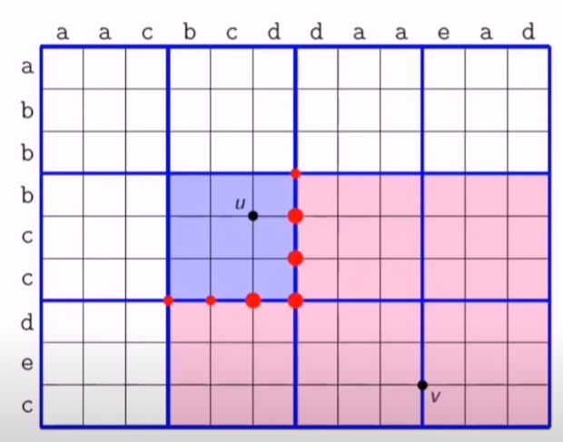{:height 406, :width 348}
- Voronoi Diagrams on the Alignment Grid
  collapsed:: true
	- We are given weights for a set S of contiguous vertices of $\partial P$, called sites.
	- The Voronoi cell of each site consists of all vertices in P^{out} that are closer to it with respect to the additive distances
	- The voronoi cell or each site s is bounded by a "double-staircase" and has a bottom-right vertex $l(s)$
	- $\{(s,l(s):s\in S\}$ is all we store (for now) => Space: $O(N\cdot \sqrt r)$
	- 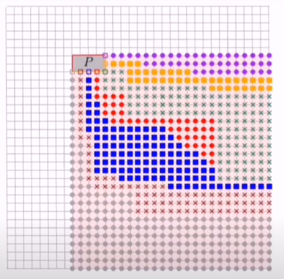{:height 356, :width 298}
- Reducing to 2 Candidate Sites
  collapsed:: true
	- Have $u\in P$ and $v\in P^{out}$. Ask for distance from u to v
	- The MSSP can answer whether v is left or right of a shortest-s-to l(s) path in logarithmic time.
		- Choose tow candidate sites:
			- remove sites to the lift of the site with the leftmost path right (from the view of that path) to v
			- remove sites to the right of the site with the rightmost path left (from the view of that path) to v
			- do binary search
	- So up to now we have:
		- Query time: $O(\log^2 n)$. We first compute two candidates, and when compute the distance to each of them using the MSSP structures.
		- | Component      | Prep-time | Space |
		  | Internal MSSPs | $N/r \cdot \tilde{O}(r)$       | $N/r \cdot \tilde{O}(r)$   |
		  | External MSSPs   | $N/r \cdot \tilde{O}(N)$ | $N/r \cdot \tilde{O}(N) $|
		  | Voronoi diagrams   | $N \cdot \tilde{O}(\sqrt r)$ | $N \cdot O(\sqrt r)$|
		  | Total   | $\tilde{O}(N^2/r + N \cdot \sqrt r)$ | $\tilde{O}(N^2/r+N \cdot \sqrt r)$|
		- Set r=2/3
		- Next we show how to construct each VD in time roughly proportional to the number of sites.
		- 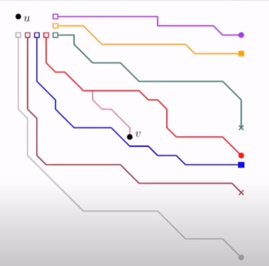{:height 364, :width 297}
- Computing VD in $\tilde{O}(|S|)$ site-to vertex Distance Queryies
  collapsed:: true
	- Aim: Compute $L=\{(s,l(s):s \in S\}$
		- 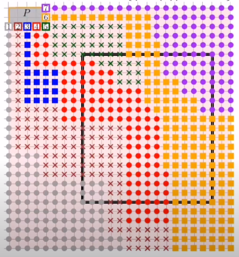{:height 544, :width 376}
	- Auxiliary operation: Decide whether a rectangle contains $l(s)$ for any $s \in S$ by looking at its boudary.
	  collapsed:: true
		- Top-left Set: {1,2,3,4,5,6,7}
		- Bottom-right: {1,2,3,4,6,7}
		- Diff: {5}
	- We can decompose the boundary using $\tilde{O}(|S|)$ site-to-vertex distance queries via binary search
	  collapsed:: true
		- We know that each colr appears in a contiguous interval, and the order of those intervals.
		- We first check using $|S|$ queryies the color of the middle vertex.
		- Our palette is then split, with the color of the middle vertex inherited by both sides.
		- We repeat this procedure $\log(n)$ times.
		- In very level, each color is active in at most two intervals.
		- Hence, the algorithm makes $\leq 2|S| \cdot \log n$ queries
		- 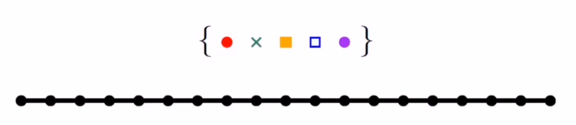{:height 183, :width 614}
		- 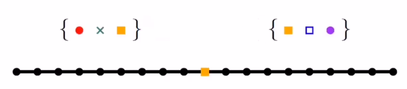{:height 238, :width 623}
		- 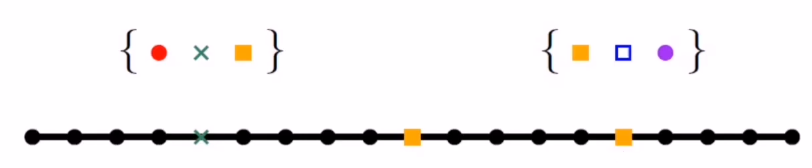{:height 195, :width 625}
		- 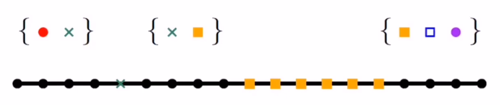{:height 286, :width 628}
		- 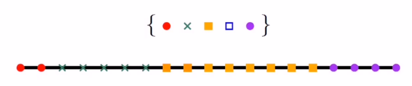{:height 247, :width 630}
		-
	- This yields an algorithm that uses $\tilde{O}(|S|^2)$ site-vertex distance queries in total: decompose the graph into 2 rectangles and recursively zoo min to interesting ones. [Split the rectangle recursively until there is only one color it int then calculate the distance, There are O(S) constant size peaces. For each of them we pay a nearly lines number of side to vertex distance queries.]
	- Now: Remove quadratic dependency by disregarding irrelevant sites in recursion.
	  collapsed:: true
		- Sites whose cells do not touch the rectangle. E.g. the blue site (no. 3)
		- If there are three sites that "enter" and "exit" the rectangle next to each other, we can remove the middle one. E.g. the brown site (no. 2)
		- In each rectangle $\square$, we consider $O(|L \cap \square)$ sites in our binary search.
- Almost-optimality via Recursion
  collapsed:: true
	- Small piece of size $r$. And Large piece of size $R$
	  collapsed:: true
		- {:height 390, :width 254}
		- 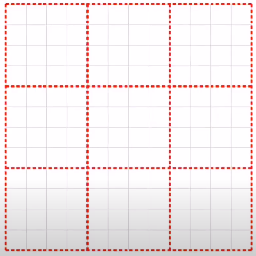{:height 432, :width 259}
	- We store internal MSSPs for small pieces. Prep-time $\tilde{O}(N)$
	  collapsed:: true
		- 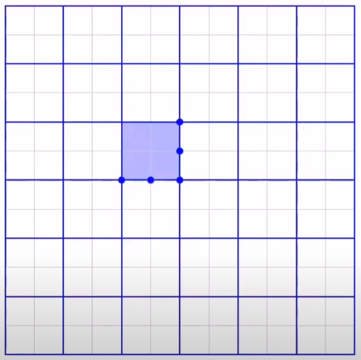
	- We store restriced extermal MSSPs for small pieces. Prep-time $N/r \cdot \tilde{O}(R)$
	  collapsed:: true
		- 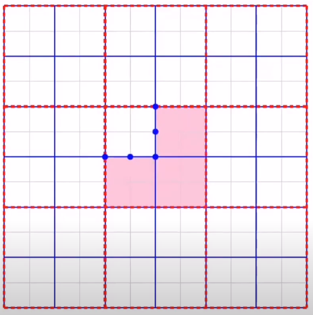
	- For large pieces, we store standard internal and extermal MSSPs. Prep-time: $\tilde{O}(N^2/R)$
	  collapsed:: true
		- 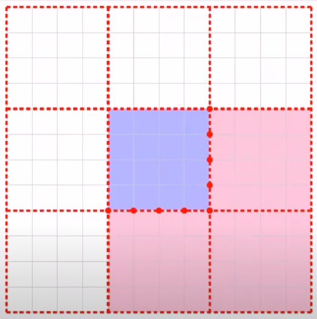
	- For each blue vertex, we store a Voronoi diagram wrt. a large piece containing it. Prep-time: $N/\sqrt r \cdot \tilde O(\sqrt R)$
	  collapsed:: true
		- 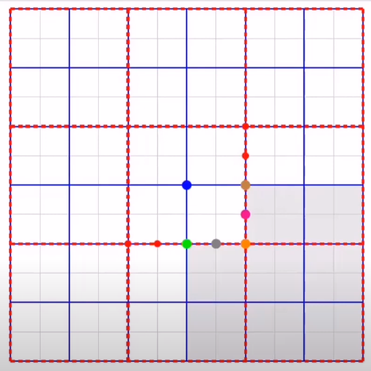{:height 466, :width 239}
	- For each vertex, we store a Voronoi diagram wrt a small piece containing it
	  collapsed:: true
		- We already know how to answer site-vertex distance queries!
		- For each site $s \in S$, we also store a middle vertex $\mu(s), to enable the left/right procedure that ends up with two candidates.
		- 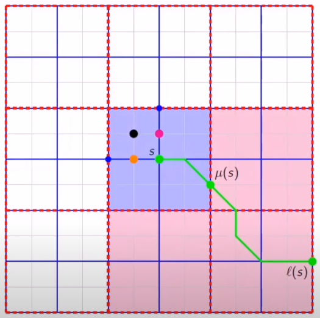{:height 367, :width 365}
		-
	- **How to answer distant queries?**
		- First, we obtain two candidate sites in the boundary of a small piece containing u
		  collapsed:: true
			- 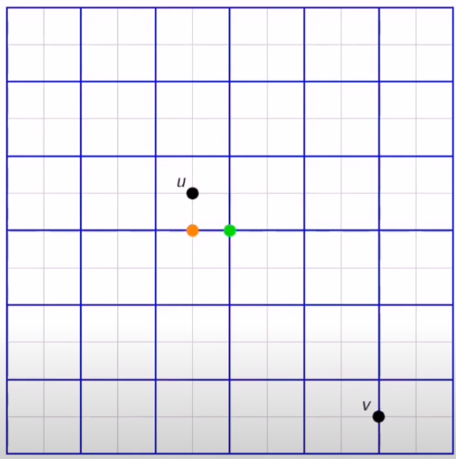{:height 528, :width 266}
		- For each of them ,we obtain who condidate sites on teh boundary of a large piece containing u
		  collapsed:: true
			- 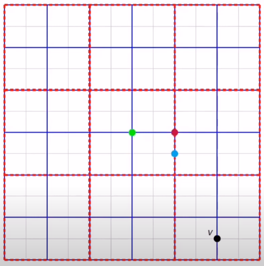{:height 479, :width 266}
		- Finally, we check all candidates using our MSSP data structures. Query time: $O(\log^2 n)$
		- By setting $r=\sqrt N$ and $R=N^3/4$, we get $\tilde{O} (N^{5/4})$ prep-time
		- Using $t$ levels (instead of just two like above), with piece-sizes $r_1=\Theta_1,...,r_t=\Theta_t$: query time $\tilde O (2^t)$, space $\tilde O(N \cdot \sum_i \frac{r_{i+1}}{r_i})$ and prep-time $\tilde O(\mathrm{space} * 2^t)$
		- Final result: Setting $r_1=\Theta(1),...,r_t=\Theta(N)$, we get query time $\log^{2+o(1)}n$, space $N^{1+o(1)}$ and prep-time $N^{1+o(1)}$
- Open questions:
  collapsed:: true
	- How close to $O(N)$ prep-time, $O(1)$ query time can we get?
	- Further investigate the space vs query time tradeoff
	- Do their ideas extend to any subclass of planar graphs?